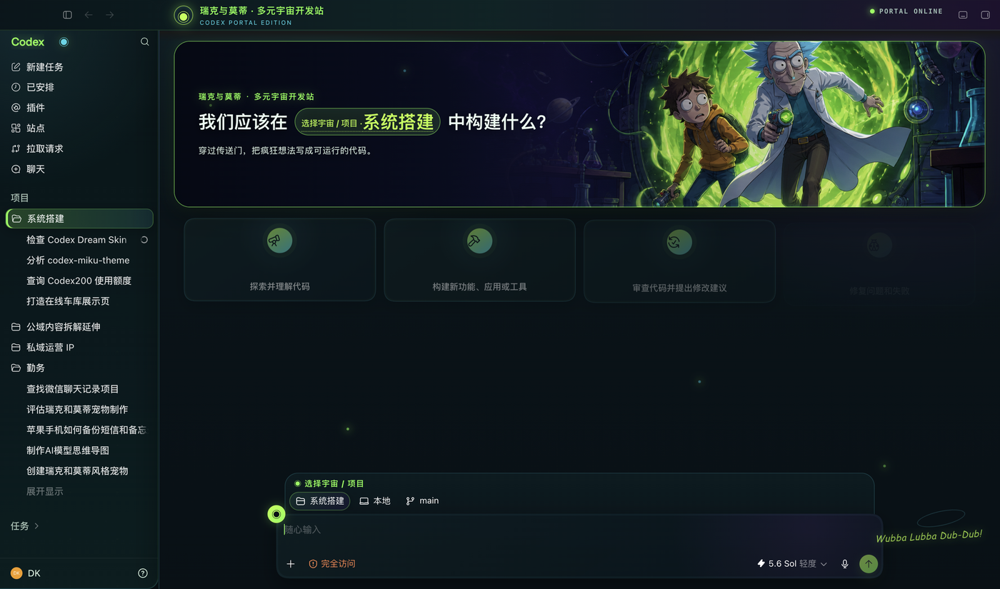
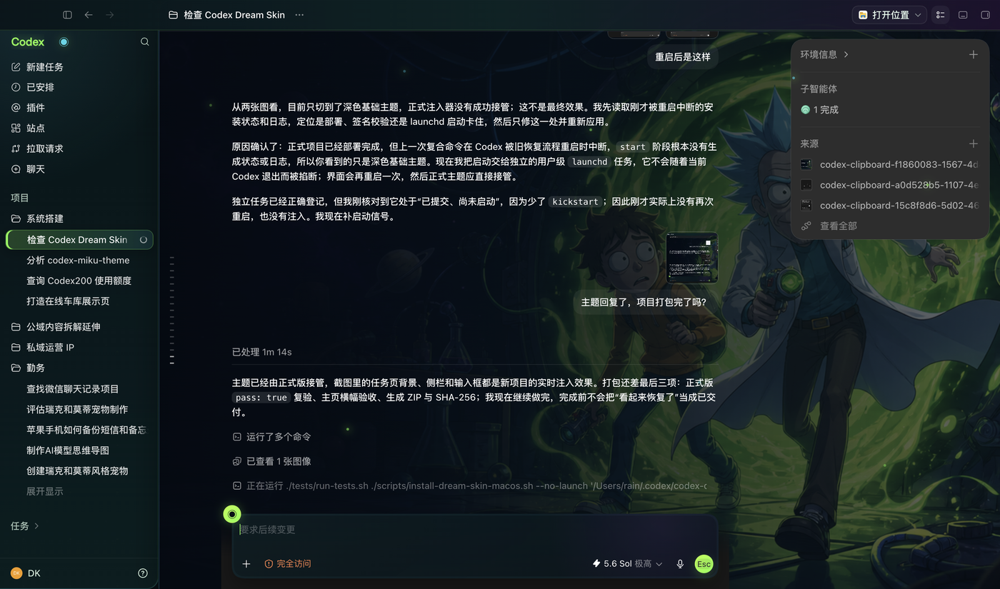

# Codex Dream Skin

<p align="center">
  官方 <strong>Codex Desktop</strong> 的外部主题 / 换肤工具（非官方、与 OpenAI 无关）。
</p>

<p align="center">
  通过本机回环 CDP 注入装饰层，不修改官方 <code>.app</code> / <code>app.asar</code> / WindowsApps，也不写入安装目录补丁。
</p>

## 效果预览

<p align="center">
  
</p>
<p align="center"><sub>macOS · 首页横幅 + 原生建议卡（CDP 实机截图）</sub></p>

<p align="center">
  
</p>
<p align="center"><sub>macOS · 任务页低干扰背景 + 磨砂内容层（CDP 实机截图）</sub></p>

| macOS 皮肤素材 | Windows 皮肤素材 |
|:---:|:---:|
|  |  |

```text
Codex-Dream-Skin/
├── README.md
├── docs/platforms.md
├── docs/images/    # README 效果图与赞助商 Logo
├── macos/          # Mac 完整主题编辑器（选图定制 / 验证 / 恢复）
└── windows/        # Windows 单皮肤注入包
```

## 平台差异

| | **macos/** | **windows/** |
|--|------------|--------------|
| 成熟度 | 更完整：选图定制、验收、恢复、打包 | 较早的固定皮肤方案 |
| 目标 App | 官方 `com.openai.codex` | Microsoft Store `OpenAI.Codex` |
| 换肤 | 用户自选图片 + 配色 | 固定 CSS / 装饰素材 |
| 安装落点 | `~/.codex/codex-dream-skin-studio` | 脚本目录 + `%LOCALAPPDATA%\CodexDreamSkin` |
| 注入 | 本机 CDP + launchd | 本机 CDP + Node 守护进程 |

两套都是 **本机安装、本机注入**，不能嵌进官方 Codex 安装包。

## macOS 快速使用

1. 打开 [`macos/`](./macos/)
2. 双击 `Install Codex Dream Skin.command`  
   或：`./scripts/install-dream-skin-macos.sh --no-launch`
3. 使用桌面入口：启动 / 定制 / 验证 / 恢复
4. 客户 ZIP：`macos/scripts/build-client-release.sh`

详细说明见 [`macos/README.md`](./macos/README.md)。

## Windows 快速使用

1. 打开 [`windows/`](./windows/)
2. PowerShell（需 Node + 官方 Codex）：

```powershell
.\scripts\install-dream-skin.ps1
.\scripts\start-dream-skin.ps1 -RestartExisting
.\scripts\verify-dream-skin.ps1
.\scripts\restore-dream-skin.ps1
```

说明见 [`windows/SKILL.md`](./windows/SKILL.md)。

## 安全边界

- 只连 `127.0.0.1` 上的 CDP，主题运行期间勿跑来路不明的本机程序
- 不修改官方二进制与签名
- 主题**不会**改写 API Key / Base URL；模型接入请自行配置

跨平台路径见 [`docs/platforms.md`](./docs/platforms.md)。

## 赞助商

<p align="center">
  <a href="https://passion8.cc/register?aff=TuPe">
    
  </a>
</p>

<p align="center">
  <a href="https://passion8.cc/register?aff=TuPe"><strong>Passion8｜感谢 passion8.cc 赞助本项目</strong></a><br>
  感谢 <a href="https://passion8.cc/register?aff=TuPe">passion8.cc</a> 赞助本项目。Passion8 提供稳定、易接入的 AI API 中转服务，支持 Codex / Claude Code / Grok 等常用编程工具接入，适合日常开发与长期使用。
</p>

<table>
  <tr>
    <th width="180">🏆 赞助商 🏆</th>
    <th>介绍</th>
  </tr>
  <tr>
    <td align="center">
      <a href="https://passion8.cc/register?aff=TuPe">
        
      </a>
    </td>
    <td>
      <a href="https://passion8.cc/register?aff=TuPe"><strong>Passion8｜passion8.cc</strong></a><br>
      感谢 <a href="https://passion8.cc/register?aff=TuPe">passion8.cc</a> 赞助了本项目！Passion8 是面向开发者的 AI API 中转站，支持 Codex、Claude Code、Grok 等工具接入，提供文档与控制台令牌管理。主题安装与 API 配置互相独立，本项目不会自动改写你的模型供应商设置。
    </td>
  </tr>
</table>

## 许可与声明

- macOS 引擎：见 [`macos/LICENSE`](./macos/LICENSE)（MIT）与 [`macos/NOTICE.md`](./macos/NOTICE.md)
- 非 OpenAI 官方产品；Codex 为相关权利人商标
- Windows 包内素材可能含定制图；公开再分发前请确认授权

---

本仓库仅整理主题工具。若需配置第三方 API 中转，请参阅对应服务商文档，与换肤步骤分开进行。
