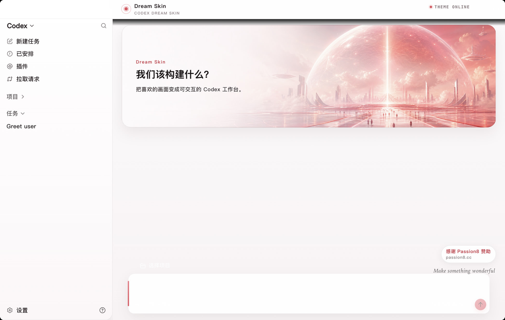

# Codex Dream Skin

  <strong>中文</strong> · <a href="./README.en.md">English</a>

  <strong>给 Codex 桌面端换一张会呼吸的脸。</strong> 
  外部主题 / 换肤工具 · 本机 CDP 注入 · 不改官方安装包

  非 OpenAI 官方产品。不修改 <code>.app</code>、<code>app.asar</code> 或 WindowsApps。

本项目 Fork 自 [Fei-Away/Codex-Dream-Skin](https://github.com/Fei-Away/Codex-Dream-Skin)。上游归属、提交历史与贡献者署名通过 GitHub Fork 网络保留。

## 这个 Fork 做了什么

这个 Fork 面向可公开分发、隐私安全、随时可恢复的桌面换肤工具，不把仓库做成真人、角色或品牌主题素材合集。

- 从当前 `main` 移除真人肖像、受保护角色、品牌主题包，以及可能暴露账号、聊天、任务标题或本机路径的截图。
- 只保留程序化生成的抽象示例；用户自己的图片、主题库、配置与运行副本只留在本机。
- 完善 Windows 双击安装、启动、托盘换图和 Restore 流程，同时保留 macOS 菜单栏切换与本地图片导入。
- 将 CDP 限制在 `127.0.0.1`，不修改 Codex 官方二进制、签名、`app.asar` 或 WindowsApps。
- 补齐中英文使用说明、素材权利边界、Issue/PR 模板和跨平台回归测试。

作为 GitHub Fork，上游提交历史仍属于同一 Fork 网络；本 Fork 的当前 `main` 与后续 Release 不再分发已移除的媒体素材。若从上游历史取用素材，请自行核验肖像权、著作权和商标授权。

## 从一张图开始

这个项目把你有权使用的纯背景图变成可安装、可切换、可验证、可恢复的 Codex 皮肤。仓库默认只分发抽象示例素材，不提供真人、角色或品牌主题包。

Windows 最短路径：

1. 准备一张没有侧栏、按钮、输入框或可读文字的宽幅纯背景图。
2. 下载并解压仓库，双击 [`windows/Install Codex Dream Skin.cmd`](./windows/Install%20Codex%20Dream%20Skin.cmd)。
3. 从系统托盘选择「更换背景图」，导入自己的图片。
4. 检查新建任务页、普通任务页和输入框；满意后保存当前主题。
5. 需要退出时，使用 Restore 快捷方式恢复官方 Codex。

macOS 安装后可从菜单栏切换仓库内的程序化抽象预设，也可以导入自己的图片。完整操作见 [`macos/README.md`](./macos/README.md)。

   
  示例只展示背景与原生控件的组合；公开截图应使用虚构任务和脱敏内容

安装、启动或恢复失败时，错误会保留在弹窗和 `%LOCALAPPDATA%\CodexDreamSkin\*-error.log`。部分 Microsoft Store 环境需要约 1.8GB 的本机启动副本；它不是主题素材，不会进入 GitHub 或 Release。

## 它能做什么

- 原生控件保持可交互，不把整张假 UI 当作背景。
- 宽幅纯背景连续铺满整窗，任务页自动降低干扰。
- 支持导入、保存和切换本地主题。
- 支持一键暂停和恢复官方外观。
- CDP 只绑定 `127.0.0.1`，不修改官方二进制或签名。

## 快速入口

| 平台 | 目录 | 入口 |
|---|---|---|
| macOS | [`macos/`](./macos/) | 双击 `Install Codex Dream Skin.command` |
| Windows | [`windows/`](./windows/) | 双击 `Install Codex Dream Skin.cmd` |

进一步阅读：

- [尽量一次成功：自定义皮肤工作流](./docs/one-shot-skin-workflow.md)
- [Windows 自定义皮肤指南](./docs/windows-custom-skin-guide.md)
- [参考图与纯背景提示词](./docs/reference-background-prompt-guide.md)
- [平台差异与路径](./docs/platforms.md)
- [全部文档](./docs/INDEX.md)

## 素材与隐私边界

- 只提交你拥有或明确获准再分发的素材。
- 不提交真人肖像、受保护角色、客户品牌、私人聊天、账号名、真实任务标题或本机路径截图。
- AI 生成不自动解决肖像权、商标权或训练素材来源问题；公开发行前仍需核验。
- 用户导入的图片、主题库、配置和本机运行副本均保持在 Git 忽略范围内。

## 赞助商

感谢 [Passion8](https://passion8.cc/register?aff=TuPe) 赞助本项目。换肤与 API 配置互相独立，本项目不会自动改写模型供应商设置。

## 反馈与贡献

- Issue：使用 [Issue 模板](./.github/ISSUE_TEMPLATE/) 描述平台、版本、复现步骤和 Restore 结果。
- PR：按 [PR 模板](./.github/pull_request_template.md) 填写变更、测试结果与脱敏截图。

## 许可

软件代码采用 [MIT License](./LICENSE)。示例素材和第三方标识不因代码许可而自动获得再分发授权，详见 [NOTICE.md](./NOTICE.md)。
